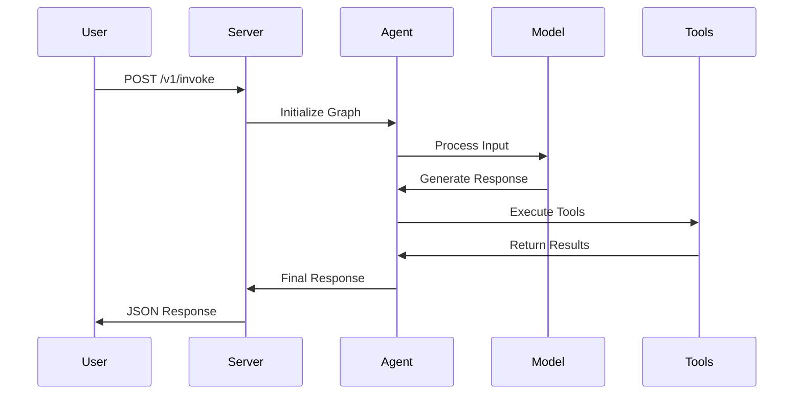
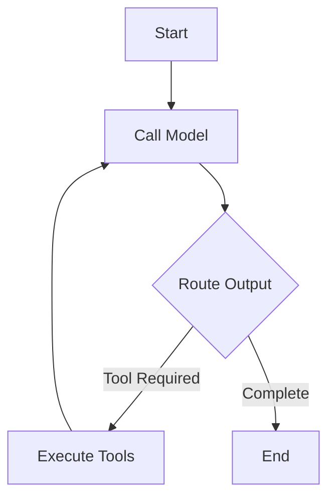
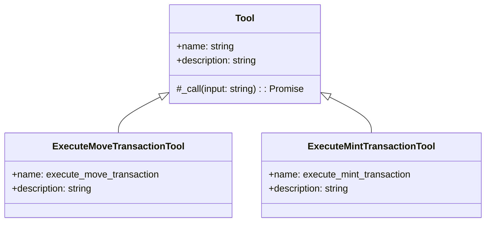

# LangGraph ReAct Agent

A TypeScript-based ReAct agent built with LangGraph.js for handling token transfers and minting operations across multiple blockchains.

## Architecture



## Core Components

### State Graph Flow



### Tools Architecture



## Setup

1. Install dependencies:

```bash
pnpm install
```

2. Create `.env` file based on `.env.example`:

```typescript:agent/.env.example
startLine: 1
endLine: 15
```

3. Build the project:

```bash
pnpm build
```

## Development

The agent uses a state graph architecture powered by LangGraph.js. Key files:

- **Graph Definition**: See `src/react_agent/graph.ts`
- **Tools**: Located in `src/react_agent/tools.ts`
- **Configuration**: Managed in `src/react_agent/configuration.ts`

### Running Tests

```bash
# Unit tests
pnpm test

# Integration tests
pnpm test:int
```

## Docker Deployment

1. Build image:

```bash
docker build -t react-agent .
```

2. Run with docker-compose:

```bash
docker-compose up
```

The service exposes:
- API endpoint: `http://localhost:8123`
- Redis: Port 6379
- Postgres: Port 5432

## API Usage

### Invoke Agent

```typescript
POST /v1/invoke

{
  "message": "I want to transfer 1 token to 0x123...",
  "threadId": "unique-thread-id"
}
```

Response:

```json
{
  "message": "Transaction submitted: {...}"
}
```

## Environment Variables

Required environment variables:
- `LANGCHAIN_API_KEY`: LangChain API key
- `ANTHROPIC_API_KEY`/`OPENAI_API_KEY`: LLM provider key
- `TG_BOT_TOKEN`: Telegram bot token (optional)

## Project Structure

```
.
├── src/
│   ├── react_agent/
│   │   ├── graph.ts          # Core agent logic
│   │   ├── tools.ts          # Available tools
│   │   ├── configuration.ts  # Agent config
│   │   └── prompts.ts        # System prompts
│   └── index.ts              # Express server
├── tests/
│   ├── unit/
│   └── integration/
└── docker-compose.yml        # Container orchestration
```

## Contributing

1. Fork the repository
2. Create feature branch
3. Commit changes
4. Push to branch
5. Create Pull Request

## License

MIT License - see LICENSE file for details.

## Dependencies

Key dependencies:

```typescript:agent/package.json
startLine: 19
endLine: 33
```

## Security

- Environment variables are properly handled through dotenv
- Docker secrets management for production
- Input validation on all API endpoints
- Rate limiting on production endpoints

## Error Handling

The agent implements comprehensive error handling:
- API errors with proper status codes
- Transaction failures with detailed messages
- Model errors with graceful degradation
- Network timeouts with retries

## Performance Considerations

- Redis caching for repeated queries
- Postgres for persistent storage
- Docker volume management
- Health checks on all services
