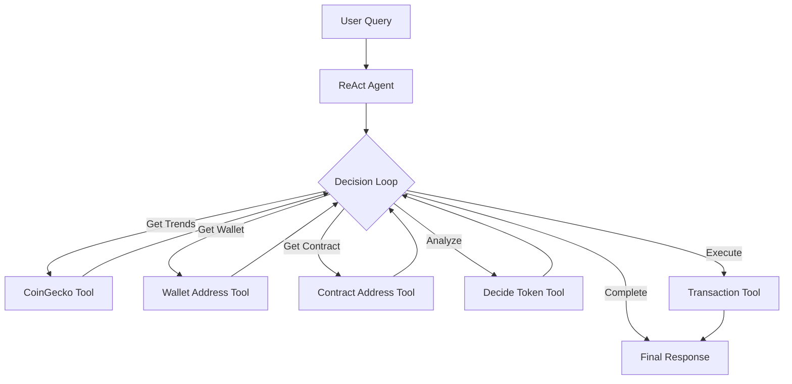
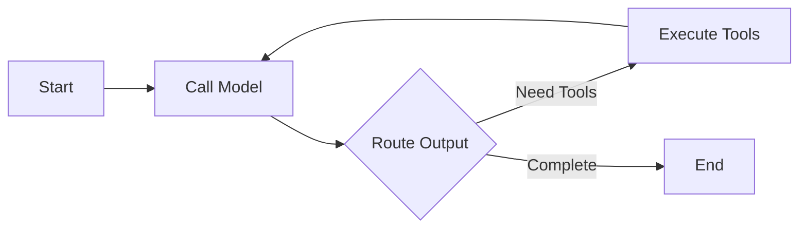

# Crypto Trading Telegram Bot

A Telegram bot powered by LangGraph.js that monitors trending cryptocurrencies and executes trades based on user interactions.

## Features

- 🔍 Monitors trending tokens via CoinGecko
- 💡 Analyzes trading opportunities
- 💰 Executes transactions on Polygon testnet
- 🤖 Uses ReAct agent pattern for decision making

## Architecture

**Flow Diagram:**



**Agent Graph:**



## Tools

1. **CoinGeckoTrendingTool**: Fetches top trending tokens
2. **GetWalletAddressTool**: Gets bot's wallet address
3. **GetContractAddressTool**: Fetches token contract addresses
4. **DecideTokenTool**: Analyzes and selects tokens to trade
5. **ExecuteTransactionTool**: Executes trades on Polygon testnet

## Setup

### Option 1: Local Setup

1. Clone the repository:

```bash
git clone <repository-url>
cd <repository-name>
```

2. Install dependencies:

```bash
yarn install
```

3. Configure environment:

```bash
cp .env.example .env
```

4. Add required API keys to `.env`:

```
ANTHROPIC_API_KEY=xxx  # or OPENAI_API_KEY
TG_BOT_TOKEN=xxx
```

5. Run tests:

```bash
yarn test
```

### Option 2: Docker Setup

Run the API using Docker Compose:

```bash
# Build and start the services
docker compose up --build

# The API will be available at http://localhost:8123
```

Docker Compose will:

- Start the LangGraph API server
- Set up Redis for state management
- Configure Postgres for data persistence
- Handle environment variables from .env file

To stop the services:

```bash
docker compose down
```

## Usage

The bot follows this workflow:

1. Monitors trending tokens:

   - Fetches wallet address
   - Gets trending tokens from CoinGecko
   - Retrieves contract addresses

2. When user expresses trading intent:
   - Analyzes message context
   - Uses DecideToken tool
   - Executes transaction
   - Returns transaction hash

## Development

- Uses TypeScript
- Built on LangGraph.js
- Integration with LangSmith for tracing
- Hot reload support for local development

## Testing

```bash
# Unit tests
yarn test

# Integration tests
yarn test:int
```

## Environment Variables

Required environment variables:

- `ANTHROPIC_API_KEY` or `OPENAI_API_KEY`: LLM API key

## Contributing

1. Fork the repository
2. Create feature branch
3. Commit changes
4. Push to branch
5. Create Pull Request

## License

MIT License - see LICENSE file for details
